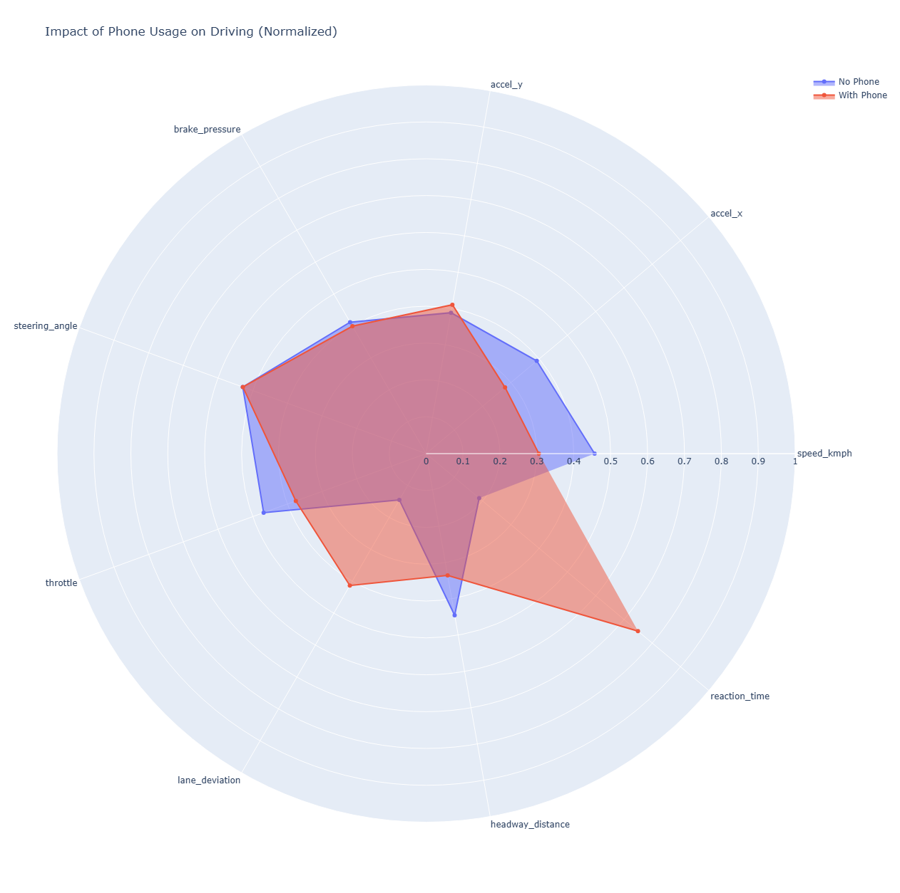

## 👋 What is this project?
We all know that insurance prices often feel unfair. Why should a safe driver pay the same as a reckless one just because they are the same age?

I wanted to solve this problem using data. I took a dataset with over 30,000 driving trips (telematics) and built a system that actually sees how you drive. The goal was to group drivers based on their behavior, not just their demographics.

## 🛠️ My Tech Stack
I used **Python** as the main tool. Here is why I chose these specific libraries:
* **SQLite:** I moved data from CSV to SQL to practice writing queries and to handle data more efficiently.
* **Pandas & NumPy:** Used for data manipulation and vectorizing my math formulas (it's much faster than loops!).
* **Scikit-learn:** Used for K-Means clustering to find hidden patterns in the data.
* **Plotly:** I wanted interactive charts (Radar Charts) to visualize the "personality" of each driver cluster.

## 🚀 How I built it

### 1. Data Cleaning & ETL
The raw CSV data wasn't ready for analysis. I wrote a script to extract it and load it into a local SQLite database using context managers (to keep connections safe).

### 2. The "Risk Score" (My Custom Metric)
I didn't just want to rely on the machine. I created my own formula to calculate how dangerous a driver is.
I combined physics and logic:
- If speed > 90 km/h → Penalty
- If phone usage = True → Huge Penalty (this is dangerous!)
- I also added penalties for tailgating (low headway distance) and aggressive braking.

### 3. Machine Learning (The cool part)
I used K-Means Clustering to segment the drivers.
- Challenge: K-Means relies on distance, so `Speed` (0-120) would overpower `Reaction Time` (0-1).
- Solution: I used `StandardScaler` to normalize all features before feeding them into the model.

---

## 📊 What I found (Results)

The algorithm automatically found 3 distinct types of drivers. I didn't label them manually, the math did it for me.

### 1. The "Phone Effect" is real
My analysis showed a clear correlation: drivers who use phones have much worse **lane discipline** (they swerve more) and **slower reaction times**.

### 2. The 3 Driver Personas
* 🟢 Cluster 1 (The Safe Drivers): They keep a good distance from the car in front and accelerate smoothly. Business idea: Give them a discount.
* 🔵 Cluster 0 (Distracted): Average speed, but they react slowly and struggle to stay in the lane. Likely using phones.
* 🔴 Cluster 2 (The Racers): High speeds, hard braking, and high G-forces. These are the high-risk clients.

(Here is the Radar Chart generated by my code)

---

## 🧠 What I learned
This project taught me that data normalization is critical for K-Means. At first, my clusters didn't make sense because the speed variable was too dominant. After fixing the scaling, the groups became very clear.

I also learned how to use **Plotly** for radar charts, which turns out to be the best way to compare multi-dimensional data like this.

---

## 💻 How to run it
1. Clone the repo.
2. Install requirements: `pip install pandas numpy seaborn plotly scikit-learn`
3. Run `main.py`.

It will generate the database, perform the analysis, and open the interactive graphs in your browser.
